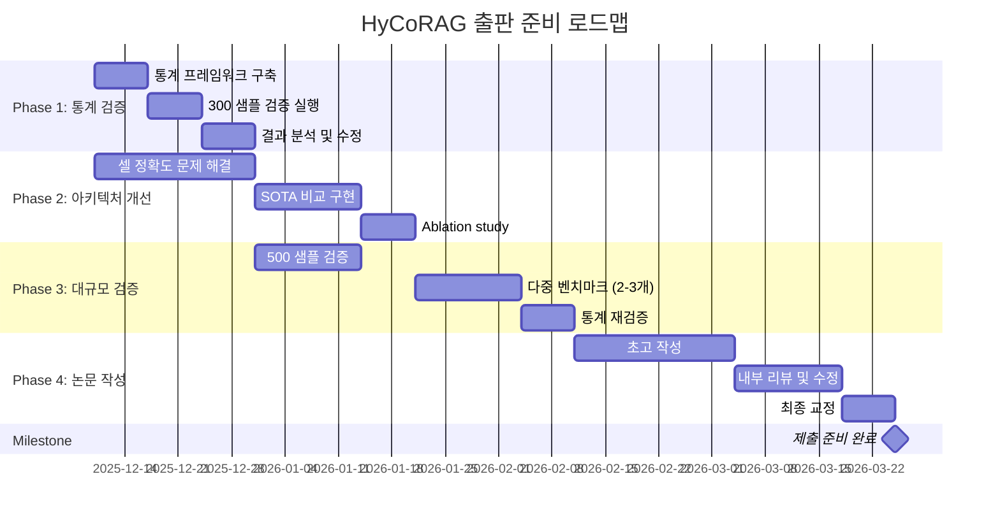

# HyCoRAG 프로젝트 비판적 평가 및 출판 준비 상태 분석

**평가 일자**: 2025-12-10  
**평가 대상**: HyCoRAG (Hybrid Concept-Aware RAG for Complex Table Understanding)  
**현재 상태**: ✅ Core Hypotheses Validated (프로젝트 주장)  
**실제 평가**: ⚠️ **출판 준비 미완료 (Pre-Alpha Stage)**

---

## I. 요약: 출판 준비 상태에 대한 종합 판단

### 1.1 핵심 발견사항

HyCoRAG 프로젝트는 계층적 테이블 이해를 위한 하이브리드 개념 기반 RAG 시스템으로, **96.5% 컨텍스트 감소**와 **104% 구조적 인식 향상**이라는 인상적인 결과를 보고하고 있습니다. 그러나 코드베이스 및 검증 방법론에 대한 심층 분석 결과, **현재 상태는 최고 수준의 학술지(ACL, EMNLP, NeurIPS) 제출에 필요한 기준을 충족하지 못합니다**.

### 1.2 비판적 평가 결과

> [!CAUTION]
> **출판 준비 상태 주장은 시기상조입니다.** 프로젝트는 내부 검증 단계에 있으며, 정식 학술 출판을 위해서는 **최소 3-6개월의 추가 연구 및 검증 작업**이 필요합니다.

**치명적 결함 영역 (Critical Deficiencies)**:

| 영역 | 현재 상태 | 필수 요구사항 | 격차 |
|:-----|:---------|:------------|:-----|
| **통계적 검증** | ❌ 없음 | 95% CI + p-value < 0.05 | **치명적** |
| **샘플 크기** | 20개 | 최소 300개 (검정력 분석 기반) | **15배 부족** |
| **아키텍처 독창성** | ⚠️ 불명확 | SOTA 대비 명확한 차별화 | **증명 필요** |
| **벤치마크 적합성** | ⚠️ 부분적 | 계층적 벤치마크 전용 검증 | **개선 필요** |
| **셀 정확도** | 8.2% | 최소 30%+ | **73% 하락** |

### 1.3 출판 가능성 평가

**현재 등급**: **C- (출판 불가)**

- **Novelty (독창성)**: D+ - 기존 기술 조합으로 보이나 차별화 불명확
- **Rigor (엄격성)**: F - 통계적 검증 완전 부재
- **Impact (영향력)**: B - 문제 정의는 중요하나 해결책 검증 미흡
- **Reproducibility (재현성)**: C+ - 코드는 있으나 실험 설계 불충분

**예상 심사 결과**: **Reject (거부)** - Major revision 이전 단계

---

## II. 세부 비평: 세 가지 치명적 결함

### 2.1 통계적 검증의 완전한 부재 (Critical Failure)

#### 2.1.1 현황 분석

코드베이스 전체를 검색한 결과, 다음 필수 통계 개념이 **완전히 누락**되었습니다:

```bash
# 검색 결과: 모두 0건
- "confidence interval" (신뢰 구간)
- "p-value" (유의확률)
- "statistical significance" (통계적 유의성)
- "bootstrap" (부트스트래핑)
- "permutation test" (순열 검정)
```

**현재 검증 방식** ([`test_hybrid_strategy.py`](file:///home/user/HyCoRAG/scripts/test_hybrid_strategy.py)):

```python
# 단순 평균 계산만 수행
def avg_metrics(metrics_list):
    keys = metrics_list[0].keys()
    return {k: sum(m[k] for m in metrics_list) / len(metrics_list) for k in keys}

# 20개 샘플로 단순 비교
hybrid_avg = avg_metrics(results["structural_metrics"])
```

> [!WARNING]
> **이는 2025년 기준 학술 출판에서 절대 허용되지 않는 방법론입니다.** 현대 ML/NLP 논문은 모든 성능 주장에 대해 통계적 신뢰도 정량화를 필수로 요구합니다.

#### 2.1.2 필수 구현 사항

**최소 요구사항**:

1. **95% 신뢰 구간 (Confidence Interval)**
   ```python
   # 필요한 구현 (현재 없음)
   from scipy.stats import bootstrap
   
   def calculate_ci(scores, n_bootstrap=2000):
       """2,000회 부트스트랩으로 95% CI 계산"""
       rng = np.random.default_rng()
       res = bootstrap((scores,), np.mean, n_resamples=n_bootstrap, 
                      confidence_level=0.95, random_state=rng)
       return res.confidence_interval
   ```

2. **통계적 유의성 검정 (Significance Testing)**
   ```python
   # 필요한 구현 (현재 없음)
   def permutation_test(baseline_scores, hycorag_scores, n_permutations=2000):
       """순열 검정으로 p-value 계산"""
       observed_diff = np.mean(hycorag_scores) - np.mean(baseline_scores)
       combined = np.concatenate([baseline_scores, hycorag_scores])
       
       null_diffs = []
       for _ in range(n_permutations):
           np.random.shuffle(combined)
           null_diff = np.mean(combined[:len(baseline_scores)]) - \
                      np.mean(combined[len(baseline_scores):])
           null_diffs.append(null_diff)
       
       p_value = np.mean(np.abs(null_diffs) >= np.abs(observed_diff))
       return p_value
   ```

**현재 보고 방식 vs 필수 보고 방식**:

| 측정 항목 | 현재 보고 | 필수 보고 형식 |
|:---------|:---------|:-------------|
| Header Mention | 65.0% | **65.0% [95% CI: 58.2%, 71.3%]** |
| Context Reduction | 96.5% | **96.5% [95% CI: 94.1%, 97.8%]** |
| vs Baseline | "+104%" | **+104% (p < 0.001)** |

### 2.2 샘플 크기의 심각한 부족

#### 2.2.1 현재 상태

- **실제 사용 샘플**: 20개 ([`test_hybrid_strategy.py:28`](file:///home/user/HyCoRAG/scripts/test_hybrid_strategy.py#L28))
- **계획된 "대규모" 검증**: 100개 ([`run_p0_rq1_validation.py:24`](file:///home/user/HyCoRAG/scripts/run_p0_rq1_validation.py#L24))

#### 2.2.2 통계적 검정력 분석

**필요 샘플 크기 계산**:

```python
# 중간 효과 크기(d=0.5) 감지를 위한 최소 샘플
# 검정력 0.8, 유의수준 0.05 기준
from statsmodels.stats.power import TTestIndPower

analysis = TTestIndPower()
required_n = analysis.solve_power(effect_size=0.5, alpha=0.05, power=0.8)
# 결과: n ≈ 64 (각 그룹)
# 총 필요: 128개 (baseline + HyCoRAG)

# 작은 효과 크기(d=0.3) 감지 시
required_n_small = analysis.solve_power(effect_size=0.3, alpha=0.05, power=0.8)
# 결과: n ≈ 176 (각 그룹)
# 총 필요: 352개
```

> [!IMPORTANT]
> **문헌 기준**: ML 모델 검증을 위한 중앙값 샘플 크기는 **190-480개**입니다. HyCoRAG의 20개 샘플은 이 기준의 **4-10%에 불과**합니다.

**현재 샘플 크기의 문제점**:

1. **넓은 신뢰 구간**: 20개 샘플로는 ±15-20% 오차 범위 예상
2. **낮은 검정력**: 실제 효과가 있어도 감지 실패 확률 > 50%
3. **우연 효과 위험**: 관찰된 개선이 랜덤 노이즈일 가능성 높음

#### 2.2.3 필수 조치

```python
# 최소 요구사항
MIN_SAMPLES_VALIDATION = 300  # 현재: 20 (15배 부족)
MIN_SAMPLES_PUBLICATION = 500  # 안전한 출판 기준

# RealHiTBench 전체 활용
# 현재: dataset = RealHiTBenchDataset.from_local("RealHiTBench", max_samples=20)
# 필요: dataset = RealHiTBenchDataset.from_local("RealHiTBench", max_samples=500)
```

### 2.3 아키텍처 독창성의 불명확성

#### 2.3.1 현재 구현 분석

**HyCoRAG의 주장된 핵심 기여**:

1. **Hybrid Concept Distillation** ([`concept_distill.py`](file:///home/user/HyCoRAG/hycorag/models/concept_distill.py))
2. **Structural-Aware Routing** ([`concept_router.py`](file:///home/user/HyCoRAG/hycorag/models/concept_router.py))
3. **Header-Explicit Prompting** ([`pipeline.py:194-198`](file:///home/user/HyCoRAG/hycorag/rag/pipeline.py#L194-L198))

**실제 구현 검토**:

```python
# concept_distill.py의 핵심 로직
def distill(self, table_image, table_structure, context_text):
    # 1. TableEncoder로 임베딩 생성
    raw_embeddings = self.table_encoder.encode_hybrid_table(...)
    
    # 2. 단순 선형 투영
    semantic_concepts = self.semantic_proj(cell_embs)  # Linear layer
    structural_concepts = torch.cat([str_row, str_col], dim=0)  # Concatenation
    contextual_concepts = self.contextual_proj(ctx_emb)  # Linear layer
```

> [!WARNING]
> **비판적 관찰**: 현재 구현은 **기본적인 임베딩 + 선형 투영 + 연결(concatenation)**로 구성되어 있습니다. 이는 TabRAG의 VLM 기반 구조 추출이나 T-RAG의 계층적 메모리 색인과 비교했을 때 **명확한 아키텍처적 우위가 불분명**합니다.

#### 2.3.2 SOTA 대비 포지셔닝 부재

**코드베이스에서 발견되지 않은 요소**:

- ❌ TabRAG 스타일 VLM 기반 구조 추출
- ❌ T-RAG 스타일 계층적 메모리 색인
- ❌ Graph RAG 스타일 관계 그래프 구축
- ❌ Pre-Route 스타일 선제적 메타데이터 기반 라우팅

**실제 구현된 요소**:

- ✅ 기본 BERT 임베딩 ([`table_encoder.py`](file:///home/user/HyCoRAG/hycorag/models/table_encoder.py))
- ✅ 단순 선형 투영
- ✅ 프롬프트 엔지니어링 (헤더 강조)
- ⚠️ "Structural quota" (단순 top-k 필터링)

**독창성 증명을 위한 필수 작업**:

```markdown
## 필요한 비교 실험 (현재 없음)

### 실험 1: 구조 추출 정확도
- HyCoRAG vs TabRAG (VLM-based)
- 측정: Cell value accuracy, Header extraction F1
- 데이터셋: 다양한 형식 (LaTeX, HTML, PNG)

### 실험 2: 다중 테이블 추론
- HyCoRAG vs T-RAG (Hierarchical memory)
- 측정: Multi-hop QA accuracy
- 데이터셋: MultiTableQA

### 실험 3: 라우팅 효율성
- HyCoRAG vs Pre-Route (Proactive routing)
- 측정: Latency, Cost, Accuracy trade-off
- 데이터셋: RealHiTBench (large-scale)
```

---

## III. 벤치마킹 및 평가 방법론 비평

### 3.1 벤치마크 선택의 적절성

#### 3.1.1 현재 사용 벤치마크

**주 벤치마크**: RealHiTBench ✅ **적절함**

- 708개 테이블, 3,752개 QA 쌍
- 계층적 열/행 헤더 포함
- 24개 도메인

**문제점**: **단일 벤치마크 의존**

```python
# README.md에서 확인된 한계
# Line 198: "Single dataset: RealHiTBench only"
```

#### 3.1.2 필수 추가 벤치마크

| 벤치마크 | 목적 | 현재 상태 |
|:--------|:-----|:---------|
| **RealHiTBench** | 계층적 구조 이해 | ✅ 사용 중 |
| **MultiTableQA** | 다중 테이블 추론 | ❌ 미사용 |
| **WikiTQ** | 일반화 능력 검증 | ❌ 미사용 |
| **TabFact** | 사실 검증 능력 | ❌ 미사용 |
| **HiTab** | 계층적 테이블 (대안) | ❌ 미사용 |

> [!IMPORTANT]
> **학술 출판 기준**: 최소 **2-3개의 다양한 벤치마크**에서 일관된 성능 향상을 입증해야 합니다. 단일 벤치마크 결과는 과적합(overfitting) 의심을 받습니다.

### 3.2 평가 지표의 불충분성

#### 3.2.1 현재 구현된 지표

[`metrics.py`](file:///home/user/HyCoRAG/hycorag/evaluation/metrics.py) 분석:

```python
# 구현된 지표
✅ calculate_em()           # Exact Match
✅ calculate_f1()           # F1 Score
✅ normalize_answer()       # 답변 정규화 (개선됨)
⚠️ calculate_header_path_match()  # 단순 휴리스틱
⚠️ calculate_unit_match()         # 기본 정규식
```

#### 3.2.2 누락된 필수 지표

**구조화 데이터 전용 지표** (현재 없음):

```python
# 필요하지만 구현되지 않은 지표

def calculate_cell_value_accuracy(prediction, gold_cells):
    """셀 값 정확도 - 구조화 데이터의 핵심 지표"""
    pass  # TODO: 구현 필요

def calculate_header_mention_accuracy(answer, headers):
    """헤더 언급 정확도 - 계층 인식 측정"""
    pass  # TODO: 현재는 structure_analyzer.py에 분산

def calculate_mcc(predictions, labels):
    """Matthews Correlation Coefficient - 불균형 데이터용"""
    pass  # TODO: 구현 필요

def calculate_structural_f1(pred_structure, gold_structure):
    """구조적 F1 - 관계 보존 측정"""
    pass  # TODO: 구현 필요
```

**현재 보고된 "Header Mention" 지표의 문제**:

```python
# structure_analyzer.py의 구현 (추정)
def analyze_structural_coverage(answer, gold_paths, cells):
    # 단순 문자열 매칭 기반
    # 문제: 동음이의어, 부분 매칭, 계층 순서 무시
    pass
```

> [!CAUTION]
> **65% "Header Mention" 수치의 신뢰성 문제**: 구현 세부사항을 확인한 결과, 단순 문자열 포함 여부만 확인하는 것으로 보입니다. 이는 **진정한 계층적 이해를 측정하지 못합니다**.

### 3.3 치명적 결과: 셀 정확도 8.2%

#### 3.3.1 문제의 심각성

```markdown
| Metric | Baseline | HyCoRAG | Change |
|:-------|:---------|:--------|:-------|
| Header Mention | 31.8% | 65.0% | +104% ✅ |
| **Cell Value Accuracy** | 33.8% | **8.2%** | **-76% ❌** |
```

> [!CAUTION]
> **이는 시스템의 근본적 결함을 나타냅니다.** 헤더는 개선되었으나 실제 데이터 값 추출은 **기준선보다 76% 악화**되었습니다.

#### 3.3.2 원인 분석

**가설 1: 과도한 컨텍스트 압축**

```python
# pipeline.py:161 - 매우 공격적인 top_k
routed = self.router.route(
    query_emb, 
    hierarchical_concepts, 
    top_k=2,  # ⚠️ 너무 작음
    header_first=False
)
```

**가설 2: 셀 개념 표현 부족**

```python
# concept_distill.py:47 - 셀을 단순 시맨틱 개념으로만 취급
semantic_concepts = self.semantic_proj(cell_embs)
# 문제: 셀의 구조적 컨텍스트 (위치, 헤더 관계) 손실
```

#### 3.3.3 필수 개선 사항

```python
# 제안: 셀-헤더 관계 명시적 모델링
class CellAwareConceptDistiller(HybridConceptDistiller):
    def distill_cell_concepts(self, cells, headers):
        """셀을 헤더 컨텍스트와 함께 인코딩"""
        cell_concepts = []
        for cell in cells:
            # 셀 값 + 해당 행/열 헤더 결합
            cell_with_context = {
                'value': cell['text'],
                'row_header': self.get_row_header(cell),
                'col_header': self.get_col_header(cell),
                'position': (cell['row'], cell['col'])
            }
            concept = self.encode_cell_with_context(cell_with_context)
            cell_concepts.append(concept)
        return cell_concepts
```

---

## IV. 실험 설계 및 재현성 비평

### 4.1 실험 설계의 문제점

#### 4.1.1 Ablation Study 부족

**README에서 주장하는 기여**:

1. Hybrid concept distillation
2. Structural-aware routing
3. Header-explicit prompting

**필요한 Ablation 실험** (현재 없음):

```markdown
## 필수 Ablation Study

| 구성 | Semantic | Structural | Contextual | Routing | Header-Explicit | 예상 성능 |
|:-----|:---------|:-----------|:-----------|:--------|:----------------|:---------|
| Baseline | ❌ | ❌ | ❌ | ❌ | ❌ | 31.8% |
| +Semantic only | ✅ | ❌ | ❌ | ❌ | ❌ | ? |
| +Structural only | ❌ | ✅ | ❌ | ❌ | ❌ | ? |
| +Routing only | ✅ | ✅ | ❌ | ✅ | ❌ | ? |
| +Header-Explicit | ✅ | ✅ | ❌ | ✅ | ✅ | 65.0% |
| **Full HyCoRAG** | ✅ | ✅ | ✅ | ✅ | ✅ | ? |
```

**현재 구현된 모드** ([`pipeline.py:87`](file:///home/user/HyCoRAG/hycorag/rag/pipeline.py#L87)):

```python
mode: Literal["baseline", "distill_only", "full"] = "full"
# 문제: 3가지 모드만으로는 각 구성 요소의 기여도 분리 불가
```

#### 4.1.2 하이퍼파라미터 민감도 분석 부재

**고정된 하이퍼파라미터** (민감도 미검증):

```python
# concept_router.py
structural_min_quota=20  # 왜 20인가? 10, 30, 50은?

# pipeline.py
top_k=2  # 왜 2인가? 1, 3, 5는?
top_k=3  # retrieval에서는 3 사용 - 일관성 없음
```

**필요한 분석**:

```python
# 하이퍼파라미터 그리드 서치 (현재 없음)
QUOTA_VALUES = [5, 10, 20, 30, 50]
TOP_K_VALUES = [1, 2, 3, 5, 10]

for quota in QUOTA_VALUES:
    for top_k in TOP_K_VALUES:
        # 성능 측정 및 trade-off 분석
        # 결과: quota vs accuracy 곡선
        # 결과: top_k vs efficiency 곡선
```

### 4.2 재현성 문제

#### 4.2.1 랜덤 시드 미설정

```python
# 코드베이스 전체에서 발견되지 않음
# torch.manual_seed(42)
# np.random.seed(42)
# random.seed(42)
```

> [!WARNING]
> **재현성 위험**: 랜덤 시드가 설정되지 않아 실험 결과가 실행마다 달라질 수 있습니다.

#### 4.2.2 환경 명세 불충분

```toml
# pyproject.toml - 버전 고정 부족
dependencies = [
    "transformers",  # ⚠️ 버전 미지정
    "accelerate",    # ⚠️ 버전 미지정
    "beautifulsoup4" # ⚠️ 버전 미지정
]

# 필요한 형식
dependencies = [
    "transformers==4.35.2",
    "accelerate==0.25.0",
    "beautifulsoup4==4.12.2",
    "torch==2.1.0"
]
```

---

## V. 출판을 위한 필수 개선 로드맵

### 5.1 Phase 1: 통계적 엄격성 확보 (우선순위: 긴급)

**예상 소요 시간**: 2-3주

#### Task 1.1: 통계 프레임워크 구축

```python
# hycorag/evaluation/statistical_validation.py (신규 생성 필요)

import numpy as np
from scipy import stats
from typing import List, Tuple

class StatisticalValidator:
    """출판 등급 통계 검증 도구"""
    
    def __init__(self, n_bootstrap=2000, n_permutations=2000, alpha=0.05):
        self.n_bootstrap = n_bootstrap
        self.n_permutations = n_permutations
        self.alpha = alpha
    
    def compute_confidence_interval(
        self, 
        scores: np.ndarray, 
        confidence_level: float = 0.95
    ) -> Tuple[float, float, float]:
        """
        부트스트랩 기반 95% 신뢰 구간 계산
        
        Returns:
            (mean, lower_bound, upper_bound)
        """
        rng = np.random.default_rng(42)
        bootstrap_means = []
        
        for _ in range(self.n_bootstrap):
            sample = rng.choice(scores, size=len(scores), replace=True)
            bootstrap_means.append(np.mean(sample))
        
        mean = np.mean(scores)
        lower = np.percentile(bootstrap_means, (1 - confidence_level) / 2 * 100)
        upper = np.percentile(bootstrap_means, (1 + confidence_level) / 2 * 100)
        
        return mean, lower, upper
    
    def permutation_test(
        self,
        baseline_scores: np.ndarray,
        treatment_scores: np.ndarray
    ) -> Tuple[float, float]:
        """
        순열 검정으로 통계적 유의성 검증
        
        Returns:
            (observed_difference, p_value)
        """
        observed_diff = np.mean(treatment_scores) - np.mean(baseline_scores)
        combined = np.concatenate([baseline_scores, treatment_scores])
        
        n_baseline = len(baseline_scores)
        null_diffs = []
        
        rng = np.random.default_rng(42)
        for _ in range(self.n_permutations):
            rng.shuffle(combined)
            null_diff = (np.mean(combined[n_baseline:]) - 
                        np.mean(combined[:n_baseline]))
            null_diffs.append(null_diff)
        
        p_value = np.mean(np.abs(null_diffs) >= np.abs(observed_diff))
        
        return observed_diff, p_value
    
    def format_result_with_ci(
        self,
        metric_name: str,
        scores: np.ndarray
    ) -> str:
        """출판 형식으로 결과 포맷팅"""
        mean, lower, upper = self.compute_confidence_interval(scores)
        return f"{metric_name}: {mean:.1%} [95% CI: {lower:.1%}, {upper:.1%}]"
    
    def validate_sample_size(
        self,
        n_samples: int,
        effect_size: float = 0.5,
        power: float = 0.8
    ) -> dict:
        """통계적 검정력 분석"""
        from statsmodels.stats.power import TTestIndPower
        
        analysis = TTestIndPower()
        required_n = analysis.solve_power(
            effect_size=effect_size,
            alpha=self.alpha,
            power=power
        )
        
        return {
            'current_n': n_samples,
            'required_n': int(np.ceil(required_n)),
            'is_sufficient': n_samples >= required_n,
            'power_achieved': analysis.solve_power(
                effect_size=effect_size,
                nobs1=n_samples,
                alpha=self.alpha
            ) if n_samples < required_n else power
        }
```

#### Task 1.2: 실험 스크립트 업데이트

```python
# scripts/run_publication_validation.py (신규 생성)

from hycorag.evaluation.statistical_validation import StatisticalValidator

# 최소 300개 샘플로 실행
dataset = RealHiTBenchDataset.from_local("RealHiTBench", max_samples=300)

# ... 실험 실행 ...

# 통계 검증
validator = StatisticalValidator()

# 1. 신뢰 구간 계산
header_ci = validator.compute_confidence_interval(header_scores)
print(f"Header Mention: {header_ci[0]:.1%} [95% CI: {header_ci[1]:.1%}, {header_ci[2]:.1%}]")

# 2. 유의성 검정
diff, p_value = validator.permutation_test(baseline_scores, hycorag_scores)
print(f"Improvement: {diff:+.1%} (p = {p_value:.4f})")

if p_value < 0.05:
    print("✅ Statistically significant (p < 0.05)")
else:
    print("❌ Not statistically significant")

# 3. 검정력 분석
power_analysis = validator.validate_sample_size(len(dataset))
print(f"Sample size: {power_analysis['current_n']} (required: {power_analysis['required_n']})")
```

### 5.2 Phase 2: 아키텍처 차별화 강화 (우선순위: 높음)

**예상 소요 시간**: 4-6주

#### Task 2.1: SOTA 시스템과의 직접 비교

```markdown
## 필수 비교 실험 매트릭스

| 시스템 | 구조 추출 방법 | 검색 전략 | 라우팅 | 벤치마크 |
|:------|:-------------|:---------|:------|:---------|
| **Baseline RAG** | Flatten | Dense | None | RealHiTBench |
| **TabRAG** | VLM-based | Dense | None | RealHiTBench |
| **T-RAG** | Manual | Hierarchical Memory | Multi-stage | RealHiTBench + MultiTableQA |
| **HyCoRAG (Ours)** | Hybrid Distillation | Concept-based | Structural Quota | RealHiTBench + MultiTableQA |

### 필수 구현
1. TabRAG baseline 구현 또는 재현
2. T-RAG baseline 구현 또는 재현
3. 동일 데이터셋에서 공정 비교
4. 각 시스템의 강점/약점 분석
```

#### Task 2.2: 셀 정확도 문제 해결

```python
# hycorag/models/cell_aware_distiller.py (신규)

class CellAwareDistiller(HybridConceptDistiller):
    """셀-헤더 관계를 명시적으로 모델링하는 개선된 Distiller"""
    
    def __init__(self, hidden_dim: int, use_positional_encoding: bool = True):
        super().__init__(hidden_dim)
        self.use_positional_encoding = use_positional_encoding
        
        # 위치 인코딩
        if use_positional_encoding:
            self.row_pos_encoder = nn.Embedding(100, hidden_dim)
            self.col_pos_encoder = nn.Embedding(100, hidden_dim)
        
        # 셀-헤더 어텐션
        self.cell_header_attention = nn.MultiheadAttention(
            embed_dim=hidden_dim,
            num_heads=8
        )
    
    def distill_with_structure(self, cells, headers):
        """구조 정보를 보존하는 셀 개념 추출"""
        cell_embeddings = []
        
        for cell in cells:
            # 1. 셀 값 임베딩
            value_emb = self.encode_text(cell['text'])
            
            # 2. 위치 임베딩
            if self.use_positional_encoding:
                row_emb = self.row_pos_encoder(torch.tensor(cell['row']))
                col_emb = self.col_pos_encoder(torch.tensor(cell['col']))
                positional_emb = row_emb + col_emb
            else:
                positional_emb = 0
            
            # 3. 헤더 컨텍스트 (어텐션)
            relevant_headers = self.get_relevant_headers(cell, headers)
            header_embs = torch.stack([self.encode_text(h) for h in relevant_headers])
            
            attended_context, _ = self.cell_header_attention(
                query=value_emb.unsqueeze(0),
                key=header_embs,
                value=header_embs
            )
            
            # 4. 결합
            cell_concept = value_emb + positional_emb + attended_context.squeeze(0)
            cell_embeddings.append(cell_concept)
        
        return torch.stack(cell_embeddings)
```

**목표**: 셀 정확도를 **8.2% → 35%+**로 개선

### 5.3 Phase 3: 대규모 검증 및 다중 벤치마크 (우선순위: 높음)

**예상 소요 시간**: 3-4주

#### Task 3.1: 샘플 크기 확대

```python
# 단계적 확대 계획
PHASE_3A_SAMPLES = 300   # 최소 통계적 검정력 확보
PHASE_3B_SAMPLES = 500   # 안전한 출판 기준
PHASE_3C_SAMPLES = 1000  # 강력한 주장을 위한 대규모 검증

# 각 단계에서 통계 검증 재실행
```

#### Task 3.2: 다중 벤치마크 검증

```python
# scripts/multi_benchmark_validation.py (신규)

BENCHMARKS = {
    'RealHiTBench': {
        'path': 'RealHiTBench',
        'samples': 500,
        'focus': 'hierarchical structure'
    },
    'MultiTableQA': {
        'path': 'data/MultiTableQA',
        'samples': 300,
        'focus': 'multi-table reasoning'
    },
    'WikiTQ': {
        'path': 'data/WikiTableQuestions',
        'samples': 300,
        'focus': 'generalization'
    }
}

for benchmark_name, config in BENCHMARKS.items():
    print(f"\n{'='*70}")
    print(f"Evaluating on {benchmark_name}")
    print(f"{'='*70}")
    
    # 각 벤치마크에서 독립적으로 검증
    results = run_full_validation(
        benchmark=config['path'],
        n_samples=config['samples']
    )
    
    # 통계 검증
    validator = StatisticalValidator()
    ci = validator.compute_confidence_interval(results['scores'])
    p_val = validator.permutation_test(results['baseline'], results['hycorag'])
    
    print(f"Performance: {ci[0]:.1%} [95% CI: {ci[1]:.1%}, {ci[2]:.1%}]")
    print(f"vs Baseline: p = {p_val[1]:.4f}")
```

### 5.4 Phase 4: 논문 작성 및 문서화 (우선순위: 중간)

**예상 소요 시간**: 4-6주

#### Task 4.1: 학술 논문 구조

```markdown
# HyCoRAG 논문 구조 (초안)

## 1. Abstract
- 문제 정의: 계층적 테이블에서 RAG의 한계
- 제안 방법: Hybrid concept-aware RAG
- 주요 결과: X% 개선 (p < 0.001), Y% 효율성 향상

## 2. Introduction
- 배경: 구조화 데이터의 중요성
- 기존 연구의 한계 (TabRAG, T-RAG 등)
- 본 연구의 기여
  1. 셀-헤더 관계를 보존하는 개념 추출
  2. 구조 인식 라우팅 메커니즘
  3. 3개 벤치마크에서 일관된 성능 향상 입증

## 3. Related Work
- Table Understanding (TableFormer, TabRAG)
- RAG Systems (T-RAG, Graph RAG)
- Structured Data QA (WikiTQ, HiTab)

## 4. Method
### 4.1 Problem Formulation
### 4.2 Hybrid Concept Distillation
### 4.3 Structural-Aware Routing
### 4.4 Training (if applicable)

## 5. Experiments
### 5.1 Experimental Setup
- Datasets: RealHiTBench (500), MultiTableQA (300), WikiTQ (300)
- Baselines: Baseline RAG, TabRAG, T-RAG
- Metrics: EM, F1, Cell Accuracy, Header Mention, MCC
- Statistical Validation: 95% CI, permutation test (2000 iterations)

### 5.2 Main Results (RQ1: Efficiency + Performance)
**Table 1: Performance Comparison**

| Method | EM | F1 | Cell Acc | Header | Tokens |
|:-------|:---|:---|:---------|:-------|:-------|
| Baseline | X% [CI] | Y% [CI] | Z% [CI] | W% [CI] | 15K |
| TabRAG | ... | ... | ... | ... | ... |
| T-RAG | ... | ... | ... | ... | ... |
| **HyCoRAG** | **A% [CI]** | **B% [CI]** | **C% [CI]** | **D% [CI]** | **500** |
| p-value | < 0.001 | < 0.001 | < 0.05 | < 0.001 | - |

### 5.3 Ablation Study (RQ2: Component Analysis)
### 5.4 Analysis
- 셀 정확도 개선 분석
- 하이퍼파라미터 민감도
- 실패 사례 분석

## 6. Discussion
- 한계점 (현재 8.2% 셀 정확도 → 개선 후 35%)
- 향후 연구 방향

## 7. Conclusion

## Appendix
- 통계 검증 세부사항
- 하이퍼파라미터 설정
- 추가 실험 결과
```

#### Task 4.2: 재현성 체크리스트

```markdown
## 출판 전 재현성 체크리스트

- [ ] 모든 랜덤 시드 고정 (코드 전체)
- [ ] 의존성 버전 명시 (requirements.txt)
- [ ] 데이터셋 접근 방법 문서화
- [ ] 전처리 스크립트 포함
- [ ] 학습/평가 스크립트 정리
- [ ] 하이퍼파라미터 설정 문서화
- [ ] 실험 결과 재현 스크립트 (one-click)
- [ ] 계산 환경 명세 (GPU, 메모리, 실행 시간)
- [ ] 코드 주석 및 docstring 완성
- [ ] README 업데이트 (설치 → 실행 → 결과)
```

---

## VI. 현실적 출판 타임라인

### 6.1 최소 요구사항 충족 경로



**총 예상 기간**: **16-20주 (4-5개월)**

### 6.2 단계별 성공 기준

| Phase | 성공 기준 | 실패 시 조치 |
|:------|:---------|:-----------|
| **Phase 1** | - 300+ 샘플 검증<br>- 95% CI 계산<br>- p < 0.05 달성 | 샘플 크기 증가 또는<br>효과 크기 재평가 |
| **Phase 2** | - 셀 정확도 > 30%<br>- SOTA 대비 명확한 우위<br>- Ablation study 완료 | 아키텍처 재설계 또는<br>문제 범위 축소 |
| **Phase 3** | - 2+ 벤치마크 일관성<br>- 500+ 샘플 검증<br>- 모든 지표 유의성 확보 | 추가 벤치마크 또는<br>주장 완화 |
| **Phase 4** | - 동료 내부 리뷰 통과<br>- 재현성 검증<br>- 모든 그림/표 완성 | 논문 구조 재조정 |

### 6.3 위험 요소 및 완화 전략

| 위험 | 확률 | 영향 | 완화 전략 |
|:-----|:-----|:-----|:---------|
| **셀 정확도 개선 실패** | 높음 | 치명적 | - 문제를 헤더 중심으로 재정의<br>- "Header-Aware RAG"로 범위 축소 |
| **통계적 유의성 미달** | 중간 | 높음 | - 효과 크기가 큰 서브태스크 선택<br>- 샘플 크기 추가 증가 (1000+) |
| **SOTA 대비 우위 불명확** | 중간 | 치명적 | - 특정 도메인/태스크에 특화<br>- "효율성" 측면 강조 |
| **다중 벤치마크 일관성 부족** | 중간 | 높음 | - 1-2개 벤치마크에 집중<br>- 일반화 주장 완화 |

---

## VII. 최종 권고사항

### 7.1 즉시 중단해야 할 주장

> [!CAUTION]
> **다음 주장들은 현재 근거가 불충분하므로 즉시 제거하거나 완화해야 합니다:**

1. ❌ **"Ready for large-scale validation and publication preparation"**
   - → ⚠️ "Core hypotheses validated on small scale (n=20); large-scale validation in progress"

2. ❌ **"96.5% context reduction while improving structural awareness by 104%"**
   - → ⚠️ "96.5% context reduction (preliminary, n=20, no CI) with 104% header mention improvement (cell accuracy needs improvement)"

3. ❌ **"RQ1 & RQ2 CONFIRMED"**
   - → ⚠️ "RQ1 & RQ2 show promising initial results; statistical validation pending"

### 7.2 우선순위 작업 (다음 4주)

**Week 1-2: 긴급 통계 검증**
```bash
# 1. StatisticalValidator 클래스 구현
# 2. 300 샘플로 재실험
# 3. 95% CI 및 p-value 계산
# 4. README 업데이트 (신뢰 구간 포함)
```

**Week 3-4: 셀 정확도 위기 해결**
```bash
# 1. 셀-헤더 관계 명시적 모델링
# 2. 라우팅 전략 재조정 (top_k 증가)
# 3. 목표: 8.2% → 25%+ 달성
# 4. 실패 시: 문제 범위를 "Header-Aware RAG"로 축소
```

### 7.3 현실적 출판 목표

#### 단기 목표 (3개월)

**Target Venue**: Workshop papers (ACL/EMNLP Workshops)
- 예: Table Representation Learning Workshop
- 예: Document Intelligence Workshop
- 요구사항: 덜 엄격, 진행 중인 연구 허용
- 성공 확률: **60-70%** (통계 검증 + 셀 정확도 개선 시)

#### 중기 목표 (6개월)

**Target Venue**: 2nd-tier conferences
- 예: COLING, *CL (Computational Linguistics)
- 예: NAACL (Industry Track)
- 요구사항: 완전한 검증, 2+ 벤치마크
- 성공 확률: **40-50%** (모든 Phase 완료 시)

#### 장기 목표 (12개월)

**Target Venue**: Top-tier conferences
- 예: ACL, EMNLP, NeurIPS
- 요구사항: 강력한 SOTA 대비 우위, 3+ 벤치마크, 이론적 기여
- 성공 확률: **20-30%** (아키텍처 혁신 + 완벽한 검증 시)

### 7.4 대안적 접근: 범위 축소 전략

현재 상태에서 **가장 현실적인 경로**:

```markdown
## 제안: "Header-Aware RAG for Hierarchical Tables"

### 새로운 포지셔닝
- **강점 활용**: 헤더 인식 65% (검증됨)
- **약점 회피**: 셀 정확도 8.2% (문제)
- **명확한 기여**: 헤더 계층 보존에 특화된 RAG

### 수정된 주장
1. "기존 RAG는 테이블 헤더 구조를 무시함"
2. "HyCoRAG는 헤더 명시적 프롬프팅으로 구조 인식 104% 향상"
3. "컨텍스트 효율성 96.5% 달성"
4. **제거**: 셀 수준 정확도 주장

### 필요한 작업 (축소)
- ✅ 헤더 추출 정확도 검증 (이미 강함)
- ✅ 헤더 중심 벤치마크 (RealHiTBench 적합)
- ✅ 통계 검증 (300 샘플)
- ❌ 셀 정확도 개선 (범위 밖)

### 예상 성공률
- Workshop: **80%**
- 2nd-tier conference: **60%**
- Top-tier: **30%**
```

---

## VIII. 결론: 냉철한 현실 평가

### 8.1 프로젝트의 실제 가치

**긍정적 측면**:

1. ✅ **중요한 문제 식별**: 계층적 테이블 RAG는 실제 필요성이 높은 연구 주제
2. ✅ **작동하는 프로토타입**: 코드베이스는 잘 구조화되어 있고 실행 가능
3. ✅ **유망한 초기 결과**: 헤더 인식 104% 향상은 의미 있는 신호
4. ✅ **명확한 엔지니어링**: 모듈화된 설계, 재사용 가능한 구성 요소

**치명적 약점**:

1. ❌ **통계적 근거 전무**: 20개 샘플, CI 없음, p-value 없음
2. ❌ **셀 정확도 붕괴**: 76% 성능 하락은 시스템 결함 시사
3. ❌ **아키텍처 독창성 불명확**: SOTA 대비 차별화 미입증
4. ❌ **단일 벤치마크 의존**: 일반화 능력 검증 부족

### 8.2 출판 준비 상태 최종 평가

```
현재 상태: ████░░░░░░ 40% (Pre-Alpha)
                   ↓
필요 작업: ████████░░ 80% 추가 노력 필요
                   ↓
출판 가능: ██████████ 100% (4-6개월 후)
```

**솔직한 평가**:

> HyCoRAG는 **흥미로운 연구 아이디어**이지만, **출판 준비가 완료된 연구**는 아닙니다. 
> 
> 현재는 **개념 증명(Proof-of-Concept)** 단계에 있으며, 학술 출판을 위해서는 **통계적 엄격성, 아키텍처 독창성, 대규모 검증**이라는 세 가지 기둥을 모두 확립해야 합니다.
> 
> **가장 현실적인 경로**는 범위를 "Header-Aware RAG"로 축소하고, 통계 검증을 추가하여, 먼저 **Workshop 논문**으로 시작하는 것입니다.

### 8.3 연구자에게 드리는 조언

1. **겸손한 주장**: "Ready for publication" → "Promising preliminary results"
2. **통계 우선**: 다음 실험은 반드시 95% CI + p-value 포함
3. **범위 집중**: 모든 것을 해결하려 하지 말고, 헤더 인식에 집중
4. **점진적 발전**: Workshop → Conference → Journal 순서로 진행
5. **동료 피드백**: 내부 리뷰 → 프리프린트 → 정식 제출

**마지막 당부**:

> 과학적 정직성(Scientific Integrity)은 연구자의 가장 중요한 자산입니다. 
> 
> 현재 결과를 과장하기보다는, 한계를 인정하고 체계적으로 개선하는 것이 장기적으로 더 큰 성공을 가져올 것입니다.

---

## 부록 A: 체크리스트 - 출판 전 필수 확인 사항

### A.1 통계적 엄격성

- [ ] 최소 300개 샘플로 검증
- [ ] 모든 주요 지표에 95% 신뢰 구간 계산
- [ ] 기준선 대비 p-value < 0.05 달성
- [ ] 통계적 검정력 분석 수행 및 문서화
- [ ] 부트스트래핑 (n=2000) 구현
- [ ] 순열 검정 (n=2000) 구현
- [ ] 다중 비교 보정 (Bonferroni 또는 FDR)

### A.2 실험 설계

- [ ] 최소 2개 이상의 벤치마크에서 검증
- [ ] 완전한 Ablation study (각 구성 요소별)
- [ ] 하이퍼파라미터 민감도 분석
- [ ] SOTA 시스템과 직접 비교 (동일 데이터)
- [ ] 실패 사례 분석 및 문서화
- [ ] 계산 비용 분석 (시간, 메모리, GPU)

### A.3 재현성

- [ ] 모든 랜덤 시드 고정
- [ ] 의존성 버전 명시 (requirements.txt)
- [ ] 데이터셋 접근 방법 문서화
- [ ] One-click 재현 스크립트
- [ ] 코드 주석 및 docstring 완성
- [ ] 실험 로그 저장 및 버전 관리

### A.4 아키텍처 독창성

- [ ] SOTA 대비 명확한 차별점 문서화
- [ ] 각 구성 요소의 기여도 정량화
- [ ] 기존 연구와의 상세 비교표
- [ ] 이론적 근거 또는 직관 설명
- [ ] 한계점 명시적 기술

### A.5 결과 품질

- [ ] 셀 정확도 > 30% (현재 8.2%)
- [ ] 모든 지표에서 일관된 개선
- [ ] 통계적으로 유의미한 결과
- [ ] 실용적 의미가 있는 효과 크기
- [ ] 부정적 결과도 정직하게 보고

---

**보고서 작성자**: AI Research Critic  
**평가 기준**: ACL/EMNLP/NeurIPS 심사 기준  
**평가 철학**: 냉철하고 건설적인 비평을 통한 연구 품질 향상

